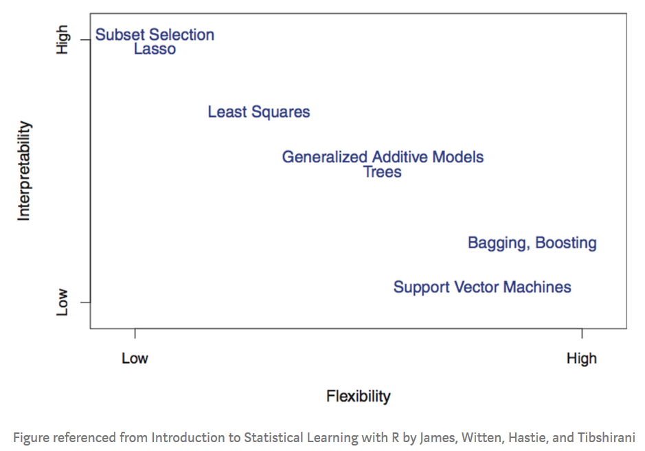

[Using Machine Learning to Predict Value of Homes On Airbnb](https://medium.com/airbnb-engineering/using-machine-learning-to-predict-value-of-homes-on-airbnb-9272d3d4739d#:~:text=Using%20Machine%20Learning%20to%20Predict%20Value%20of%20Homes,...%207%20Lessons%20Learned%20%26%20Looking%20Ahead.%20)

Below are notes from the above Airbnb blog.

- Customer Lifetime Value (LTV), a popular concept among e-commerce and marketplace companies, captures the projected value of a user for a fixed time horizon, often measured in dollar terms.
- At Airbnb, knowing users’ LTVs enable us to allocate budget across different marketing channels more efficiently, calculate more precise bidding prices for online marketing based on keywords, and create better listing segments.

Machine learning workflow
**Most time were spent on feature engineering, data cleanng and bring model into production.**
- Feature Engineering

Tool used: Airbnb’s internal feature repository — Zipline
Features are shared acorss the org, users can add their own features

Type of features:
    - Location: country, market, neighborhood and various geography features
    - Price: nightly rate, cleaning fees, price point relative to similar listings
    - Availability: Total nights available, % of nights manually blocked
    - Bookability: Number of bookings or nights booked in the past X days
    - Quality: Review scores, number of reviews, and amenities

- Prototyping and Training
    - Data Imputation: We need to check if any data is missing, and whether that data is missing at random. If not, we need to investigate why and understand the root cause. If yes, we should impute the missing values.
    - Encoding Categorical Variables: Often we cannot use the raw categories in the model, since the model doesn’t know how to fit on strings. When the number of categories is low, we may consider using one-hot encoding. However, when the cardinality is high, we might consider using ordinal encoding, encoding by frequency count of each category.
    - Use **pipelines** to specify data transformations for different types of features, depending on whether those features are of type binary, categorical, or numeric. 

- Model Selection & Validation
To make such a decision, we need to weigh the tradeoffs between model interpretability and model complexity. (Bias-Variance tradeoff)

[AutoML tools](https://medium.com/airbnb-engineering/automated-machine-learning-a-paradigm-shift-that-accelerates-data-scientist-productivity-airbnb-f1f8a10d61f8)

Tool used: Various AutoML frameworks
XGBoost performs the best and is easy to use, so it becomes the model they stick to.

- Productionization
Tool used: Airbnb’s notebook translation framework — ML Automator, + Airflow
data scientists and data engineers work closely together
How can we perform periodic re-training? 
How do we score a large number of examples efficiently? 
How do we build a pipeline to monitor model performance over time?

**Automated Machine Learning**

Automated machine learning, also referred to as automated ML or AutoML, is the process of automating the time consuming, iterative tasks of machine learning model development. It allows data scientists, analysts, and developers to build ML models with high scale, efficiency, and productivity all while sustaining model quality. [ref](https://docs.microsoft.com/en-us/azure/machine-learning/concept-automated-ml)

Repetitive tasks in ML:

Exploratory Data Analysis: Visualizing data before embarking on a modeling exercise is a crucial step in machine learning. Automating tasks such as plotting all your variables against the target variable being predicted as well as computing summary statistics can save lots of time.

Feature Transformations: There are many choices in how you can encode categorical variables, impute missing values, encode sequences and text, etc. Many of these feature transformations are canonical such that they can be reliably applied to many problems.

Algorithm Selection & Hyper-parameter Tuning: There are a dizzying number of algorithms to choose from and related hyper-parameters that can be tuned. These tasks are very amenable to automation.

Model Diagnostics: Learning curves, partial dependence plots, feature importances, ROC and other diagnostics are extremely useful to generate automatically.

Existing autoML tools:
    - TPOT
    - Auto-Sklearn
    - Auto-Weka
    - Machine-JS
    - DataRobot**
