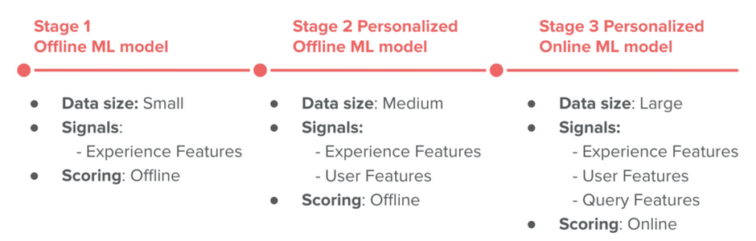
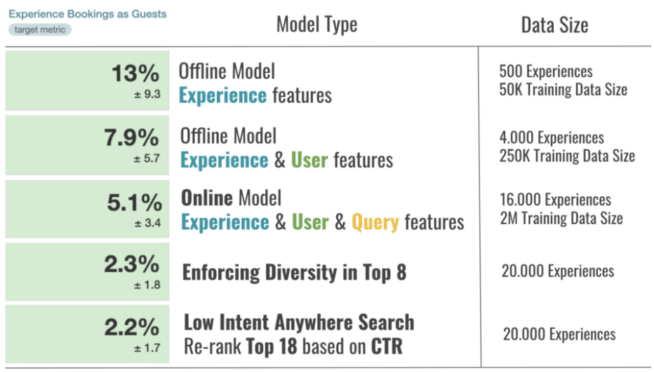

[Machine Learning-Powered Search Ranking of Airbnb Experiences](https://medium.com/airbnb-engineering/mach

Below are notes from the above Airbnb blog.

Product: Airbnb Experience
Problem: search ranking, personalization

ML development - 3 stages

key: pick the model and infrastructure with the right level of complexity for the amount of data available and the size of the inventory (Very complex models will not work well when trained with small amounts of data, and simple baselines are sub-optimal when large amounts of training data are available.)

- stage 1: non-personalized, offline, small amount of data
    - initial stage after launch, still in the data collection stage, not much items to recommend
    - baseline: randomly re-rank Experiences daily
    - data for ML model
        - search logs (i.e., clicks) of users who ended up making booking 
        - labeling data: booked - positive, clicked but not booked - negative
        - features:  
            - Experience duration (e.g. 1h, 2h, 3h, etc.)
            - Price and Price-per-hour
            - Category (e.g. cooking class, music, surfing, etc.)
            - Reviews (rating, number of reviews)
            - Number of bookings (last 7 days, last 30 days)
            - Occupancy of past and future instances (e.g. 60%)
            - Maximum number of seats (e.g. max 5 people can attend)
            - Click-through rate
    - model: binary classification, log-loss as loss function, gradient boosted decision tree (no worry scaling features or missing values)(don't use raw counts, use ratios instead -i.e., # bookings, #bookings per 1000 viewers)
    - metric: AUC and NDCF
    - partial dependency plot (what would happen to dependent variable if we fix values of all but a single feature)
    - A/B test with baseline model, big win (#bookings increase by +13%)

- stage 2: personalize
    - (a) Personalize based on booked Airbnb Homes
        A large portion of Experience bookings come from guests who already booked an Airbnb Home. Therefore, we have quite a bit of information we can use to build features for personalization:

        - Booked Home location
        - Trip dates
        - Trip length
        - Number of guests
        - Trip price (Below/Above Market)
        - Type of trip: Family, Business
        - First trip or returning to location
        - Domestic / International trip
        - Lead days
        - Distance between Booked Home and Experience (large fraction of booked Airbnb Experiences are near booked Airbnb Home)
        - Experience available during Booked Trip

    - (b) Personalize based on the user’s clicks
        - Infer user interest in certain categories: For example, if the user is mostly clicking on Music Experiences we can infer that the user’s interest is in Music
        - Infer the user’s time-of-day availability: For example, if the user is mostly clicking on Evening Experiences we can infer that the user is available at that time of day
        - Category Intensity: Weighted sum of user clicks on Experiences that have that particular category
        - Category Recency: Number of days that passed since the user last clicked on an Experience in that category.
        - Time of Day Personalization: Different Experiences are held at different times of day (e.g. early morning, evening, etc.). Similar to how we track clicks on different categories, we can also track clicks on different times of day and compute Time of Day Fit between the user’s time-of-day percentages and the Experience’s time of day. Lower score --> higher p_booking
        - separate models for logged-in and logged-out users
        - a/b test: compare with stage 1 model, bookings improve 7.9%
    deployment: daily offline computation of rankings for top 1 million active users, save rankings in a database (one-day latency)

- stage 3: online scoring
    - new features: query features (location, dates, #guests, browser language setting, country)
        - country: historical data tells us that when visiting Paris Japanese travelers prefer Classes & Workshops (e.g. Perfume making), US travelers prefer Food & Drink Experiences, while French travelers prefer History & Volunteering. We used this information to engineer several personalization features at the Origin — Destination level.
    - two gradient boosting models
        - Model for logged-in users, which uses Experience Features, Query Features, and User (Personalization) Features
        - Model for logged-out traffic, which uses Experience & Query Features, trained using data (clicks & bookings) of logged-in users but not considering Personalization Features
    - deployment
        - During the scoring stage, we first pull in all the features (User, Experience, and Query Features) from their respective locations and concatenate them in a vector used as input to the model. Next, depending on if User Features are empty or not we decide which model to use, i.e. logged-out or logged-in model, respectively. Finally, we return the model scores for all Experiences and rank them on the page in descending order of the scores.
        - The model requires three types of signals to conduct scoring: Experience Features, Query Features, and User Features. Different signals were stored differently depending on their size, update frequency, etc. Specifically, due to their large size (hundreds of millions of user keys), the User Features were stored in an online key-value store and search server boxes can look them up when a user does the search. The Experience Features are on the other hand not that large (tens of thousands of Experiences), and as such can be stored in memory of the search server boxes and read directly from there. Finally, the Query Features are not stored at all, and they are just read as they come in from the front end.

        - Experience and User Features are both updated daily as the Airflow pipeline feature generation job finishes. We are working on transitioning some of the features to the online world, by using a key-value store that has both read and write capabilities which would allow us to update the features instantly as more data comes in (e.g. new experience reviews, new user clicks, etc.).

- stage 4: handle business rules -- promote quality by using weighted cost function
 
    If guests have a really good experience they will come back and book Experiences again in the near future.
    This motivated us to experiment with our objective function, where we changed our binary classification (+1 = booked, -1 = click & not booked) to introduce weights in training data for different quality tiers (e.g. highest for very high quality bookings, lowest for very low quality bookings).
    - very high quality Experience is one with >50 reviews, >4.95 review rating and >55% guests saying the Experience was unique and better than expected.
    - very low quality Experience is one with >10 reviews, <4.7 review rating.
    
    When testing the model trained in such a way the A/B test results (on the right in the figure above) showed that we can leverage machine learning ranking to get more of very high quality bookings and less of very low quality bookings, while keeping the overall bookings neutral.

    Other business rules:
    
    - Discovering and promoting potential new hits early using cold-start signals and promoting them in ranking (this led to +14% booking gain for new hits and neutral overall bookings)
    
    - Enforcing diversity in the top 8 results such that we can show the diverse set of categories, which is especially important for low-intent traffic (this led to +2.3% overall booking gain).

- Monitoring and Explaining Ranking
    - Dashboard that tracks rankings of specific Experiences in their market over time, as well as values of feature used by the ML model.
    - Dashboard that shows overall ranking trends for different groups of Experiences (e.g. how 5-star Experiences rank in their market).

- Room for improvement
    - Training data construction (by logging the feature values at the time of scoring instead of reconstructing them based on best guess for that day)
    - **Loss function** (e.g. by using pairwise loss, where we compare booked Experience with Experience that was ranked higher but not booked, a setup that is far more appropriate for ranking)
    - **Training labels** (e.g. by using utilities instead of binary labels, i.e. assigning different values to different user actions, such as: 0 for impression, 0.1 for click, 0.2 for click with selected date & time, 1.0 for booking, 1.2 for high quality booking)
    - Adding more real-time signals (e.g. being able to personalize based on immediate user activities, i.e. clicks that happened 10 minutes ago instead of 1 day ago)
    - Explicitly asking users about types of activities they wish to do on their trip (so we can personalize based on declared interest in addition to inferred ones)
    Tackling position bias that is present in the data we use in training
    - Optimizing for additional secondary objectives, such as helping hosts who host less often than others (e.g. 1–2 a month) and hosts who go on vacation and come back
    - Testing different models beyond GBDT
    - Finding more types of supply that work well in certain markets by leveraging predictions of the ranking model.
    - Explore/Exploit framework
    - Test human-in-the-loop approach (e.g. Staff picks)

    