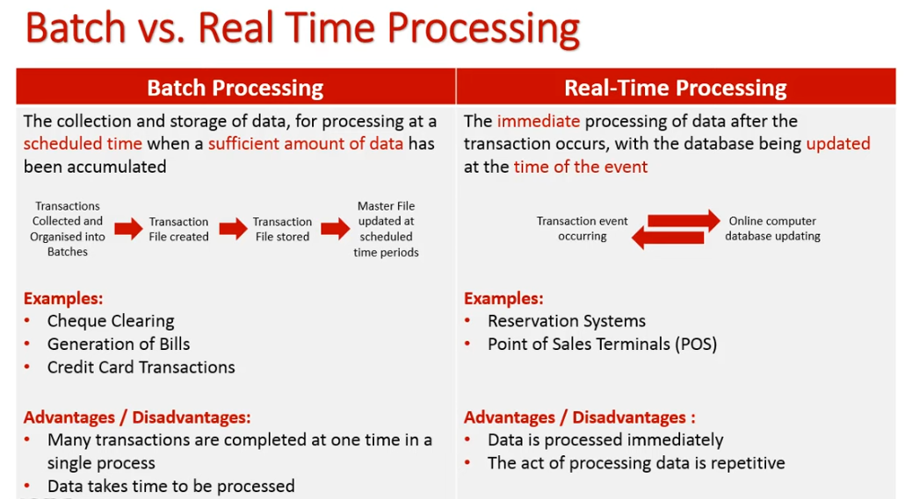
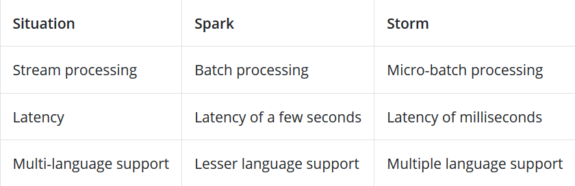

# Designing Data-Intensive Applications

Notes from this book by Martin Kleppmann
## Part I. Foundations of data systems
### SQL vs NoSQL

- relational database (SQL):
    - query language: SQL
    - example dabases: PostgreSQL, Microsoft SQL Server, Oracle Database, MySQL, SAP HANA, Microsoft Access, and IBM Cloud Databases
- document databases (NoSQL): target use cases where data comes in self-contained documents and relationships between one document and another are rare, i.e., MapReduce; don't enforce a schema for the data
    - example databases: MongoDB, ElasticSearch, PostgreSQL
- graph databases (NoSQL): target use case where anything is potentially related to everything; don't enforce a schema for the data
    - example databases: Amazon Neptune, Microsoft SQL Server 2017

Key points:
- all three models are widely used today
- one model can be emulated in terms of another model, but result may be awkward

Major differences:
- SQL databases are relational, NoSQL are non-relational.
- SQL databases use structured query language and have a predefined schema. NoSQL databases have dynamic schemas for unstructured data.
- SQL databases are vertically scalable, NoSQL databases are horizontally scalable.
- SQL databases are table based, while NoSQL databases are document, key-value, graph or wide-column stores.
- SQL databases are better for multi-row transactions, NoSQL are better for unstructured data like documents or JSON.
- NoSQL databases offer many benefits over relational databases. NoSQL databases have flexible data models, scale horizontally, have incredibly fast queries, and are easy for developers to work with. One of the most frequently cited drawbacks of NoSQL databases is that they don’t support ACID (atomicity, consistency, isolation, durability) transactions across multiple documents.

### Data storage and Retrieval

Two types of storage engines:
- those optimized for transaction processing (OLTP)
    - user-facing, thus may see a huge volume of requests
    - applications usually touch a small number of records in each query
    - application requests records using some kind of key, and the storage engine uses an index to find the data for the requested key
    - disk seek time is often the bottleneck
    - two types of storage engine:
        - log-structured, which only permits appending to files and deleting obsolete files, but never updates a file that has been written (i.e., HBase, LSM-trees, LevelDB)
        - update-in-place, which treats the disk as a set of fixed-size pages that can be overwritten (i.e., B-tree)
- those optimized for analytics (OLAP)
    - primarily used by business analysts
    - handle a much lower volume of query, but each query may be demanding, requiring millions of records to be scanned in a short time
    - indexes are much less relevant, while encoding data compactly is more important.
    - disk bandwidth is often the bottleneck

### Data encoding and evolution

Many services need to support **rolling updates**, where a new version of a service is gradually deployed to a few nodes at a time, rather than deploying to all nodes simutaneously. Rolling upgrades allow new versions of a service to be released without downtime and make deployment less risky. Such properties are hugely beneficial for **evolvability**, the ease of making changes to an application.

Assuming different nodes are running the different versions of the application's code, it's important that all data flowing around the system is encoded in a way that provides **backward compability** (new code can read old data) and **forward compability** (old code can read new data).

Data encoding formats:
- Programming language-specific encodings are restricted to a single programming language and often fail to provide forward and backward compatibility.
- Textual formats like JSON, XML and CSV are widespread, and their compatibility depends on how you use them. These formats are somewhat vague about datatypes, so you need to be careful with things like numbers and binary strings.
- Binary schema-driven format allow efficient and compact encoding with clearly defined backward and forward compability semantics. However, they need to be decoded before it is human-readable.

Types of dataflow:
- Databases, where the process writing to the database encodes the data and the process reading from the database decodes it
- RPC and REST APIs, where the client encode a request, the server decodes the request and encodes a response, and the client finally decodes the response
- Asynchronous message passing (using message brokers or actors), where nodes communicate by sending each other messages that are encoded by the sender and decoded by the recipient

## Part II. Distributed data

### Replication

Why replication?
- **high availability**: keep the system running, even when one machine or several machines goes down
- **disconnected operation**: allowing an application to continue working when there is a network interruption
- **latency**: placing data geographically close to users, so that users can interact with it faster
- **scalability**: being able to handle a higher volume of reads than a single machine could handle, by performing reads on replicas

Replication is tricky because it requires careful thinking about concurrency and about all the things that can go wrong and dealing with the consequences of those faults (i.e., unavailable nodes, network interruptions, silent data corruption due to software bugs).

Three main approaches to replication:
- single-leader replication
    - clients send all writes to a single node (the leader), which sends a stream of data change events to the otehr replicas (followers). Reads can be performed on any replica, but reads from followers might be stale.
    - easy to understand, no conflict resolution to worry about
- multi-leader replication
    - clients send each write to one of several leader nodes, any of which can accept writes. The leaders send streams of data change events to each other and to any follower nodes.
    - more robust in the presence of faulty nodes, network interruptions and latency spikes
- leaderless replication
    - clients send each write to several nodes, and read from several nodes in parallel in order to detect and correct nodes with stale data
    - more robust in the presence of faulty nodes, network interruptions and latency spikes

Consistency models which are helpful for deciding how an application should behave under replication lag:
- read-after-write consistency: users should always see data that they submitted themselves
- monotonic reads: after users have seen the data at one point in time, they shouldn't later see the data from some earlier point in time
- consistent prefix reads: users should see the data in a state that makes causal sense: for example, seeing a question and its reply in the correct order

### Partioning**

The goal of partionining is to spread the data and query load evenly across multiple machinges, avoid hot spots (nodes with disproportionately high load). The partioning scheme needs to rebalancing the partitions when nodes are added or removed from the cluster.

Two main partioning approaches: (need to know more)
- key range partitioning, where keys are sorted, and a partition owns all the keys from some minimum up to some maximum.
    - Partitions are typically rebalanced dynamically by splitting the range into two subranges when a partition gets too big.
- hash partitioning, where a hash function is applied to each key, and a partition owns a range of hashes. This method destroys the ordering of keys, making range queries inefficient, but may distribute load more evenly.
- hybrid approach

Secondary index also needs to be partitioned and there are two methods:
- doccument-partitioned indexes (local index)
- term-partitioned indexes (global index)

### Transactions (don't quite understand, need to read more)

Transactions are an abstraction layer that allows an application to pretend that certain concurrency problems and certain kinds of hardware and software faults don't exist. A large class of errors is reduced down to a simple transaction abort, and the application just needs to try again. Transactions are a valuable database feature, no matter which data model is used.

concurrency control???
### The trouble with distributed systems
Many problems can occur with distributed systems, including the following characteristic partial failures:
- The packet sent over the network or the reply **may be lost** or arbitrarily delayed. If you don't get a reply, you have no idea whether the message got through.
- A node's clock may be significantly **out of sync** with other nodes, it may suddenly jump forward or back in time.
- A process **may pause** for a substantial amount of time at any point in its execution, be declared dead by other nodes, and then come back to life again without realizing that it was paused.

Detecting faults is hard. Mostly rely on timeouts to determine whether a remote node is still available. However, timeouts cannot distinguish between network and node failures.

Even if faults are detected, making a system tolerate it is not easy. There is no shared global variable, no shared memory, no common knowledge or any other kind of shared state between the machines. Node cannot even agree on what time it is, let alone on anything more profound. The only way information can flow from one node to another is by sending it over the unreliable network.

Advantages of distributed systems:
- scalability
- fault tolerance (can run forever without being interrupted at the service level)
- low latency (by placing data geographically close to users)

### Consistency and consensus
??

## Part III. Derived data
### Batch processing

[ref](https://www.youtube.com/watch?v=2VJLWot9T7Y)
real time processing is quite close but **not** equivalent to streaming processing

A batch is a collection of data points that have been grouped together within a specific time interval.

Batch Processing is used for Large, Complex Data Analysis

With batch processing, some type of storage is required to load the data, such as a database or a file system.

### Streaming processing
Stream Processing deals with continuous data and is used for Speedy and Real-Time Analytics

With stream processing, data is fed into an analytics system piece-by-piece as soon as it is generated.

streaming processing requires data to be fed into an analytics tool, often in micro-batches, and in real-time.

When coupled with platforms such as Apache Kafka, Apache Flink, Apache Storm, or Apache Samza, stream processing quickly generates key insights, so teams can make decisions quickly and efficiently

Different streams processing tools:

(1) **Apache Kafka**

Apache Kafka is an open-source **stream-processing** *software platform* developed by the Apache Software Foundation, written in Scala and Java. The project aims to **provide a unified, high-throughput, low-latency platform for handling real-time data feeds**.

It has the following characteristics:

- High Throughput

    Deliver messages at **network limited throughput** using a cluster of machines with latencies as low as 2ms.

- Scalable

    Scale production clusters up to a thousand brokers, trillions of messages per day, petabytes of data, hundreds of thousands of partitions. Elastically expand and contract storage and processing.

- Permanent storage

    Store streams of data safely in a distributed, durable, fault-tolerant cluster.

- High availability

    Stretch clusters efficiently over availability zones or connect separate clusters across geographic regions.

ref: https://kafka.apache.org/

Kafka stream vs Spark streaming, NiFi, Flink
- per data streaming (Kafka) vs micro batch (all others)
- no cluster required (Kafka) vs cluster required (all others)
- scales easily by just adding java processes (no re-configuration required) (Kafka)
- exactly once sematics (Kafka) vs at least once for Spark

(2) **Apache Spark**

Spark is a data parallel open source processing framework. Spark workflows are designed in Hadoop MapReduce but are comparatively more efficient than Hadoop MapReduce. The best feature of Apache Spark is that it does not use Hadoop YARN for functioning but **has its own streaming API and independent processes for continuous batch processing (Spark streaming)** across varying short time intervals. Spark runs **100 times faster than Hadoop** in certain situations, however **doesn’t have its own distributed storage system**.

(3) **Apache Storm**

Apache Storm is an advanced Big Data *processing engine* that processes the **real-time streaming** data at an unprecedented speed, which is **way faster than Apache Hadoop**. 

Storm has its independent workflows in topologies i.e. Directed Acyclic Graphs. Storm does not run on Hadoop clusters but uses Zookeeper and its own minion worker to manage its processes. 

It is scalable, fault-tolerant, guarantees your data will be processed, and is easy to set up and operate. It can also be used with any programming language. 

Apache Storm integrates with the queueing and database technologies you already use. 

### The future of data systems

