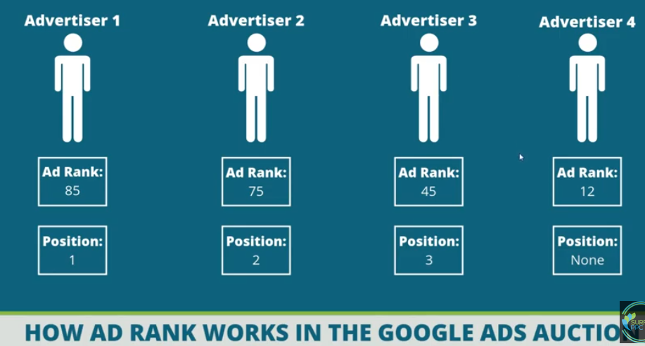
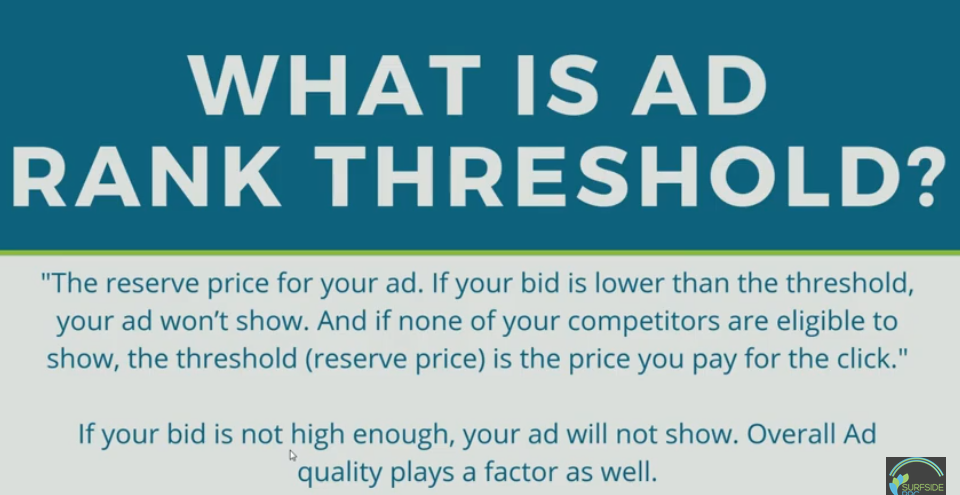

# search & ads ranking

Google ads ranking - Ad Rank
Ref: https://www.youtube.com/watch?v=osdreLTPbJE
Ad Rank is used by Google Ads to determine your Ad Position in the search results. Higher Ad Ranks mean higher ad positions vs. competitors.

Google Ads looks at the following:
- Your bid amount
- Ad quality, relevance and extensions
- Expected click-through rate
- Landing page experience
- Contect of the person's search

If ad rank score is below a preset threshold, the ad won't be shown.

*Click-through rate (CTR)* is the ratio of users who click on a specific link to the number of total users who view a page, email, or advertisement. It is commonly used to measure the success of an online advertising campaign for a particular website as well as the effectiveness of email campaigns.

