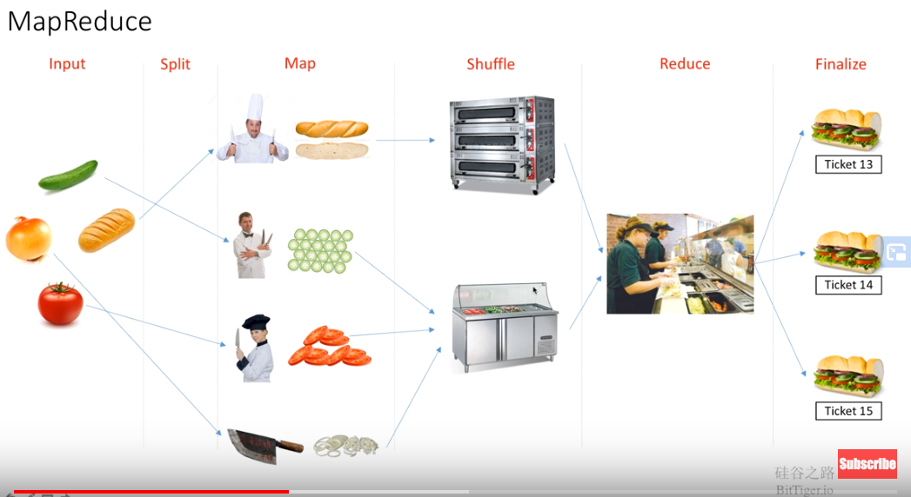
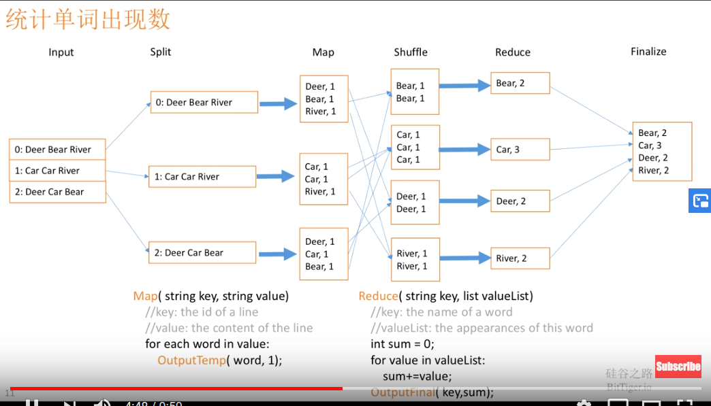
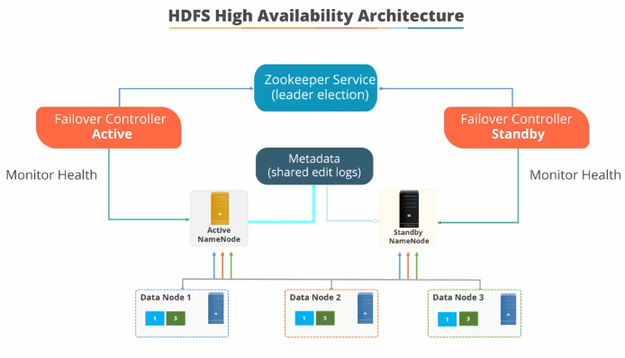
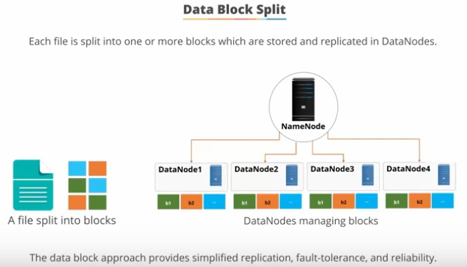
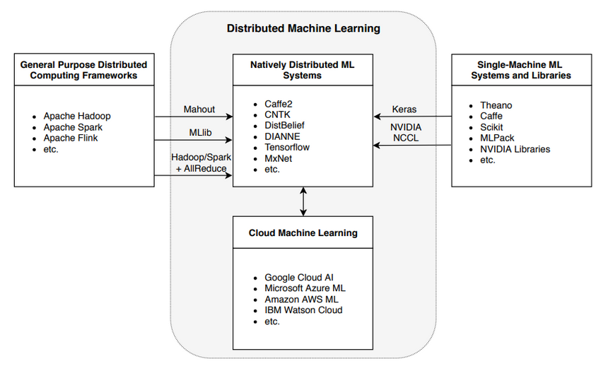

# Distributed data storage and processing:

REF: https://www.g2.com/categories/big-data-processing-and-distribution

To qualify for inclusion in the Big Data Processing and Distribution category, a product must:
Collect and process big data sets in real-time
Distribute data across parallel computing clusters
Organize the data in such a manner that it can be managed by system administrators and pulled for analysis
Allow businesses to scale machines to the number necessary to store its data

Top 10 Big Data Processing and Distribution Software

- Snowflake: cloud-based data warehouse, optimized for quick response
    It’s cloud agnostic, with unlimited, seamless scalability across Amazon Web Services (AWS) and Microsoft Azure (with the prospect of adding Google Cloud soon).
    Data processing is simplified: Users can do data blending, analysis, and transformations against various types of data structures with a single language, SQL.
    Snowflake offers dynamic, scalable computing power with charges based purely on usage.
    It empowers us to analyze a variety of data structures including CSVs, JSON, XML, Parquet, Avro, and to blend them at the same time by using SQL language.
- Qubole
Qubole’s Platform provides end-to-end data lake services such as cloud infrastructure management, data management, continuous data engineering, analytics, and machine learning with near-zero administration. 
- Hadoop HDFS
Hadoop HDFS is a distributed, scalable, and portable filesystem written in Java.
- Azure Data Lake Store
- Google BigQuery: serverless data warehouse
- Apache HBase
- Amazon EMR
- Azure 
- HDInsight
- Google Cloud Dataflow
- Databricks
- Snowplow Analytics
.png)
Google (ref: https://www.youtube.com/watch?v=Rz8JCS9TfOQ)

## MapReduce (2004): 
- MapReduce is a programming model and an associated implementation for processing and generating big data sets with a parallel, **distributed** algorithm on a cluster. 
- A MapReduce program is composed of a **map** procedure, which performs *filtering and sorting*, and a **reduce method**, which performs a *summary* operation.

ref: https://www.youtube.com/watch?v=Rz8JCS9TfOQ

## HDFS

The Hadoop Distributed File System (HDFS) is a **distributed file system** designed to run on commodity hardware. It has many similarities with existing distributed file systems. However, the differences from other distributed file systems are significant. HDFS is *highly fault-tolerant* and is designed to be deployed on *low-cost hardware*. HDFS provides high throughput access to application data and is suitable for applications that have *large data sets*. HDFS relaxes a few POSIX requirements to *enable streaming access to file system data*. 

Characteristics of HDFS:
- Fault tolerant: each block has multiple duplicated copies in worker nodes (default replication factor is 3)
- Scalable: vertical (adding more hardware) or horizontal (one adds more nodes to the system) 
- support for heterogeneous clusters (clusters with different sizes)
(name node, data node)

ref: https://www.youtube.com/watch?v=nRX4_3qf3rc

## Hadoop (2006): 
Hadoop provides a **software framework** for **distributed storage** and **processing of big data** using the **MapReduce programming model**. All the modules in Hadoop are designed with a fundamental assumption that hardware failures are common occurrences and should be automatically handled by the framework.

## Apache HBase (2007):
It is an open-source, **non-relational**, **distributed database** modeled after Google’s Bigtable and written in Java, was born. It is developed as part of the Apache Hadoop project and runs on top of HDFS.

## Spark (2009): 
Spark is an open-source **distributed** general purpose **cluster-computing framework**. It provides an interface for programming entire clusters with implicit data parallelism and fault tolerance.

## Apache Hive (2010): 
It is a data warehouse software project built on top of Apache Hadoop for providing data query and analysis. It gives **a SQL-like interface** to query data stored in various databases and file systems that integrate with Hadoop.

## REDIS
Redis is an in-memory data structure project implementing a distributed, in-memory key–value database with optional durability.
Redis, which stands for Remote Dictionary Server, is a fast, open-source, in-memory key-value data store for use as a database, cache, message broker, and queue. 
Redis is a popular choice for caching, session management, gaming, leaderboards, real-time analytics, geospatial, ride-hailing, chat/messaging, media streaming, and pub/sub apps.

# Distributed computing for machine learning purpose:

([ref](https://analyticsindiamag.com/top-tools-distributed-machine-learning-tensorflow/))

Goal of using distributed computing for machine learning is to **speed up the convergence of model training using multiple nodes**.

Challenges for developing distributed computing for machine learning ([ref](https://medium.com/@Petuum/intro-to-distributed-deep-learning-systems-a2e45c6b8e7)):

- Consistency: How can we ensure the consensus of multiple nodes if they are simultaneously working toward one goal? What if, for example, they are solving one optimization problem together, but with different partitions of the dataset?

- Fault tolerance: If we distribute our workload to a cluster of 1000 computational nodes, what if one of the 1000 nodes crashes? Is there a way to fix it other than just restarting the job from the very beginning?

- Communication: ML involves a lot of I/O (e.g. disk read and write) and data processing procedures — can we design storage systems to enable faster I/O and non-blocking data processing procedures for different types of environments (e.g. single node local disk, distributed file systems, CPU I/O, GPU I/O, etc.)?

- Resource management: Building a computer cluster is prohibitively expensive so a cluster is usually shared by many users. How should we manage the cluster and allocate resources appropriately to meet everyone’s requests while maximizing usage?

- Programming model: Should we program distributed ML models/algorithms in the same way we do for non-distributed ones? Could we design a new programming model that requires less coding and improves efficiency? Can we program in a single-node fashion while automatically amplifying the program with distributed computing techniques?

- Communication overhead: We have to spend extra time to synchronize (network communication) across multi-nodes at the end of computation in order to ensure the convergence of the ML training task. In practice, the synchronization can take as long as the computation, or even longer.

Key points  ([ref](https://medium.com/@Petuum/intro-to-distributed-deep-learning-systems-a2e45c6b8e7)):
- data parallelism 
    - step 1: each worker perform the training (i.e. stochastic gradient descent) on its own data partition and generate a set of parameter updates (i.e. gradients) thereon
    - step 2: let all nodes synchronize their parameter states by network communication until they reach a consensus

- model parallelism
    - partition the machine learning model itself to distribute the workload to multiple computational workers (i.e., partition the      matrix into many small blocks (sub-matrices), and then let each worker take care of a few)

