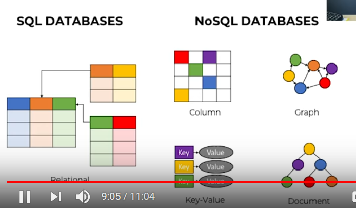
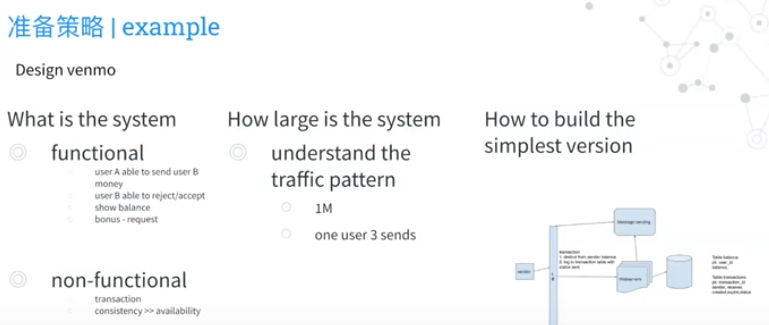
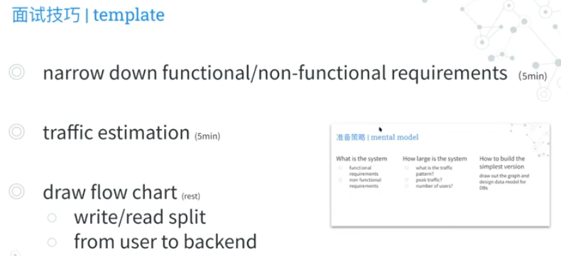

ref: https://www.youtube.com/watch?v=REB_eGHK_P4

1. Load-balancing
latency
scalability
specialized software
dns load balancing
database server

2. Caching
hit the database very hard
same data for every single layer
pop cache systems: memocache,reddis, cansadra
cds (content delivery systems) : push, poll
distributed system: AWS S3

3. Database schema design
slave-master replications
consistency: write to a database, can read immediately

web server: load balancer
database server: 

6. API design
how to transfer data
how to design security

https://www.youtube.com/watch?v=VjnXZpZ7wvs

1) what are the signals companies looking for in system design questions?

system design = distributed system design
a distributed system, also known as distributed computing, is a system with multiple components located on different machines that communicate and coordinate actions in order to appear as a **single coherent system** to end-user

failure

not about:
- not about solving the actual problem
- not about faking your senorioity
- not about spilling out buzzwords

about:
- ability to step back and ask pertinent clarifying questions to flush out what are the features we are designing
- basic understanding of core distributed system concepts such as
    - load balancing
    - sharding
    - async processing
- demonstrate abilities to **think through tradeoffs** of different system design choices (no optimal solution, only trade-offs)
    - sql vs nosql db
        - CAP 
        - availability vs consistency
        - transaction vs scalibility

how to prepare
- what is the system?
    - functional requirements
    - non-functional requirements
- how large is the system
    - what is the traffic pattern
    - peak traffic
    - number of users
- how to build the simplest version
    - draw out the graph and design data model for DBs
    

interview skill

